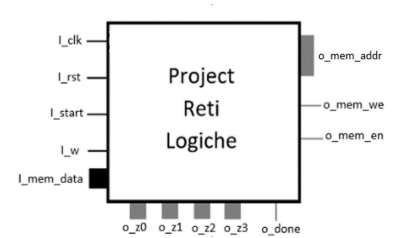

## Prova finale Progetto di [Reti Logiche](https://www11.ceda.polimi.it/schedaincarico/schedaincarico/controller/scheda_pubblica/SchedaPublic.do?&evn_default=evento&c_classe=788722&polij_device_category=DESKTOP&__pj0=0&__pj1=9cc3f34aabe22aeab794c35ef361f0cf) - a.a - 2022-2023
Qeesta è la repository che comprende il progetto del corso di Reti Logiche, anno 2022/23 del Politecnico di Milano.

  

## Struttura della repository
- Testo progetto: PDF in cui è presentata la traccia del progetto.
- Direttive generali: PDF in cui sono mostrate le regole della prova e eventuali contatti dei tutor.
- Codice.vhd: File .vhd contenente il codice del progetto.
- Relazione: PDF che schematizza e spiega come è stato sviluppato il componente. Anche questa relazione fa parte del progetto.
- readme.md e readme_images: FIle di intestazione della repository.

## Valutazione
Il seguente progetto ha conseguito una valutazione di 30 e lode.
